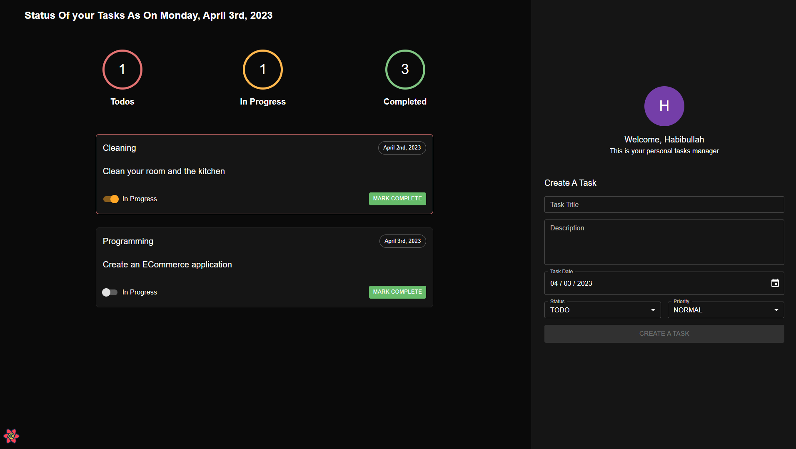

## Task Management API

[Task Management UI Repository](https://github.com/habibullahturkmen/task-management-ui)

### Teck Stack
```
# TypeScript, TypeORM, Express.js
# PostgreSQL, ESLint, and Prettier
```

### Setup/Instructions

Install node.js and yarn in your computer

install PostgreSQL to your computer and create a database

Copy ``.env.example`` to ``.env`` and fill out your environment variables

### Run ``yarn`` to install dependencies
```bash
yarn
```

### Run ``yarn dev`` to start a development server
```bash
yarn dev
```

### Or run ``yarn build && yarn start`` to start a production server

```bash
yarn build && yarn start
```

### Preview

